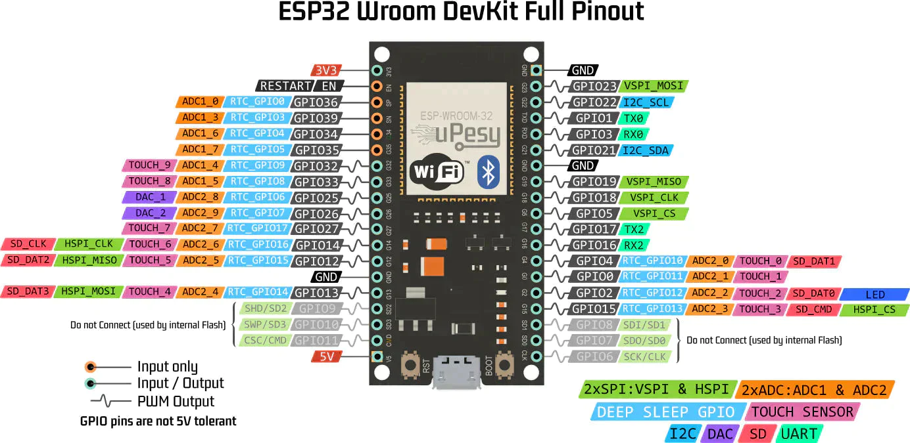

## Встановлення MicroPython

[ESP32](https://micropython.org/download/ESP32_GENERIC/)

``` bash
curl https://micropython.org/resources/firmware/ESP32_GENERIC-20240222-v1.22.2.bin -o ESP32_GENERIC-20240222-v1.22.2.bin

pip install esptool

python3 -m  esptool --chip esp32 --port /dev/ttyUSB0 erase_flash

python3 -m esptool --chip esp32 --port /dev/ttyUSB0 --baud 460800 write_flash -z 0x1000 ESP32_GENERIC-20240222-v1.22.2.bin

```

В VS code встановлюємо (Pymakr)[https://marketplace.visualstudio.com/items?itemName=pycom.Pymakr]

Встановлення [ноди](https://nodejs.org/en/download)


```
 sudo apt install picocom

```

```
from machine import Pin,Timer
p2 = Pin(2, Pin.OUT)
tim0 = Timer(0)
tim0.init(period=500, callback=lambda t:p2.value(not p2.value()))

```

(Дока)[https://docs.micropython.org/en/latest/esp32/quickref.html#]


